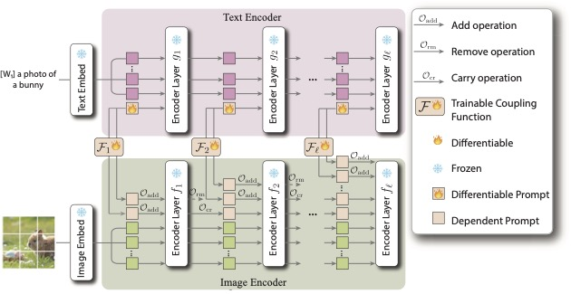

# Modular Prompt Learning Improves Vision-Language Models

This is the official implementation of the paper "Modular Prompt Learning Improves Vision-Language Models".

## Introduction

We propose a modular design for deep prompting methods.

<div align="center">
  
  <p align="center"><b>Overview of our approach</b>: Our proposed deep prompting method has add, remove and carry operations to control context lengths.</p>
</div>

<hr />

## How to Setup Environments

- Data Preparation

Please follow [DATASETS.md](docs/DATASETS.md) to install the datasets.

## How to Run

Please follow the steps below to create a virtual environment and install dependencies.

- Setup virtual environment

```bash
# create an virtual environment
conda create -n mdprompt python=3.10

# activate virtual environment
conda activate mdprompt

# install dependencies
pip install -r requirements.txt
```

- Run experiments

(1) Base-to-Novel class generalization setting

```bash
# train and evaluate on base classes
# 1st argument is dataset, possible datasets include caltech101, food101, dtd, ucf101, oxford_flowers, oxford_pets, fgvc_aircraft, stanford_cars, sun397, eurosat, imagenet
# 2nd argument is seed
bash scripts/mpl/base2new_train.sh imagenet 1
# test on noval classes
bash scripts/mpl/base2new_test.sh imagenet 1
```

(2) Cross-Dataset Transfer

Firstly train MPL on ImageNet using few-shot learning:
```bash
# seed=1 
bash scripts/mpl/xd_train.sh imagenet 1
# seed=2
bash scripts/mpl/xd_train.sh imagenet 2
# seed=3
bash scripts/mpl/xd_train.sh imagenet 3
```

Secondly evaluate MPL on downstream datasets:
```bash
for SEED in 1 2 3
do
    bash scripts/mpl/xd_test.sh caltech101 ${SEED}
    bash scripts/mpl/xd_test.sh food101 ${SEED}
done
```

## Citation

If you find our work helpful, please consider citing:
```bibtex
@inproceedings{huangmodular,
    title={Modular Prompt Learning Improves Vision-Language Models},
    author={Zhenhan Huang, Tejaswini Pedapati, Pin-Yu Chen and Jianxi Gao},
    booktitle={IEEE International Conference on Acoustics, Speech, and Signal Processing},
    year={2025}
}
```

## Acknowledgement

This repository based on [CoOp](https://github.com/KaiyangZhou/CoOp) and [MaPLe](https://github.com/muzairkhattak/multimodal-prompt-learning) repository. If you think our released code useful, please consider citing these works as well.